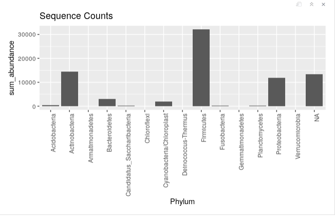
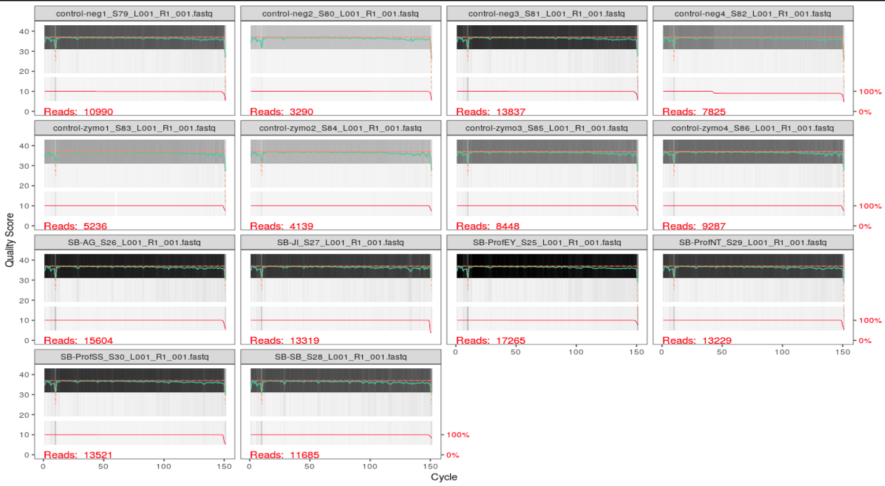

<<<<<<< HEAD
=======
---
>>>>>>> 55049c0ab6bfb3629aaaacbc4d4b4a79879de270
title: "*Staphylococcus* and Other Pathogenic Bacteria found on the Cellphone Screens of Both Students and Professors on a University Campus"
author: "Shreya Barma"
date: "November 19, 2019"
output: word_document
csl: bioinformatics.csl
bibliography: references.bib
---

```{r setup, include = FALSE}
# global setup
knitr::opts_chunk$set(echo = FALSE, message = FALSE, warning = FALSE)
```

# Introduction

When the phone was first introduced to society, its sole purpose was to be able 
to communicate with others. Today, with the evolution to the cellphone, the role
of the typical phone has drastically expanded from its intended use, to call or 
to text someone. It's now used as a GPS device, to browse the internet, play 
games, listen to music, and much more [@lonkila2008social]. Due to all of these 
new applications and the evolution of the traditional phone, cellphones are 
being used almost all day, everyday by their owners. This daily use and the 
benefits provided by a cellphone, causes individuals to overlook cellphone 
hygiene, or even consider the large amount of bacteria that accumulates on the 
screen of their phones. 

Studies have been done in clinical settings, showing how healthcare 
professionals use their cellphones throughout the day, both before and after 
assessing patients. This resulted in a significant transfer of bacteria, since 
most cellphone users, healthcare workers included, do not clean their cellphone 
screens [@arora2009cellphones]. Especially in a medical setting, this can cause 
more diseases and more infection. Healthcare workers have been found to transmit
nosocomial infections via their medical equipment and mobile phones 
[@kumar2014identification]. This puts not only cellphone users at risk, but the 
patients, the health care workers and their families as well. 

However, healthcare workers are not the only ones with phones carrying bacteria, 
studies have shown that with a general cellphone user, there is 10x more 
bacteria on a cellphone screen than a toilet seat [@akinyemi2009potential]. 
Aside from clinical settings, I aimed to focus on a school setting to see 
whether cellphones used by students and professors also carried pathogenic 
bacteria. Middle school students'cellphones have been found to have a median of 
17,032 bacterial 16S rRNA gene copies per phone. Additionally,out of the number 
of bacteria found on these phones, a significant number were found to be 
potentially pathogenic. These bacteria included *E. faecalis* and many more 
[@cogprints6566].There is an extremely large amount of pathogens on cellphones 
of secondary school students, with over 94.5% of cellphones demonstrating 
evidence of bacterial contamination [@ulger2009we]. 

Another study conducted by the Department of Microbiology at Lagos State 
University focused on the actual spread of bacterial infections through the use 
of cellphones. Through this study they found a high percentage (62.0%) of 
bacterial infection being spread solely through cellphones and the lack of 
cleaning this technology [@akinyemi2009potential]. This shows the significance 
of the bacterial presence on cellphones. I wanted to find out the relevance of 
this issue in a school setting, and whether or not pathogens would still be 
found on cellphones outside  of clinical settings. 

The purpose of my project was to show the importance of hygeine with an 
individual's technology, especially cellphones since we carry them around 
everywhere on a daily basis. My project focuses on identifying the type and 
amount bacteria on the cell phone screens of students at the University of San 
Francisco compared to those found on the cellphone screens of professors. 
This is to see whether or not phones carry potential pathogens, which are 
disease-causing bacteria, outside of a clinical setting [@schmidtchen2002proteinases].
Thus, this experiment can help build a correlation between how illnesses are 
spread on college campuses and technology usage.I will specifically focus on the
presence of *Escherichia coli*, *Staphylococcus*, and *Pseudomonas* as they are 
a few of the most common pathogens found on cellphones [@lee2013contamination]. 

These bacteria are known to cause serious infections. *Staphylococcus* for 
example, is a dangerous pathogen. This bacteria is known to cause endovascular
disorders, bone and joint disorders, respiratory issues, as well as skin 
disorders. The mortality rate ranges from 11 to 43 percent 
[@lowy1998staphylococcus]. *E.coli* is a bacteria that normally is found in the 
human intestine as well as other animals. is transmitted through contamination 
of food, such a raw meats, or through the contact with fecal matter.

My questions for this project were: Do cellphones really carry potential 
pathogens? Do students have a higher amount of bacteria on their cellphones 
compared to professors? My hypothesis is that all cellphones will carry 
potential pathogens and student cellphones will have a significantly higher amount 
of potential pathogens compared to professor cellphones. 

To test this hypothesis, I gathered a total of 6 samples using a sterile swab 
dipped in phosphate buffer solution. 3 of these samples were from different 
students and the remaining 3 samples were collected different professors. Once 
my samples were collected, I diluted each sample with PBS to 1x, 10x, and 100x 
and then cultured these samples on an agar dish. The two sets of samples, both 
the culture samples and the culture-free samples were  After incubation, I used 
PCR to amplify the DNA samples and gel electrophoresis to separate the DNA 
fragments. I, also, used Qubit to quantify DNA concentrations. Sanger sequencing
was, then, used to sequence the cultured DNA samples. With these successful 
results, I used BLAST to run my samples against the NCBI database and figure out
what strains my were. Illumina sequencing was conducted with the culture-free 
DNA samples. Once all my results were sequenced, I edited them through Geneious 
Prime, used an alignment tool, MAFFT [@katoh2013mafft], and built phylogenies 
using Mr.Bayes and PhyML [@kearse2012geneious].

With this project, I concluded that student cellphone screens had a larger 
amount of colonies, as predicted. However, the number of morphotypes found was 
higher on professors' cellphone screens. Through this experiment, *E.coli* and 
*Pseudomonas* were not detected on any of the cellphone screens for neither 
students or professors. However, two different types of *Staphylococcus* were 
detected. Another bacteria which was not expected to be found, *Kocuria palustris*, was detected. 

## Methods

### Sampling
Materials needed to collect my samples include a sterile phosphate buffer solution
(PBS), 12 1.5mL tubes, and sterile swabs. For this project, I collected a total 
of twelve samples, two samples per cellphone. Therefore, I swabbed a total of 
six phones, three from each sample group. To collect my samples, I used a 
sterile swab dipped in the buffer solution. I swabbed the entire front screen of
each phone for 30 seconds and then stored the swab in a sterile tube. Once I 
finished collecting all my samples, I broke off the portion of the swab with my 
sample on it into separate tubes and labeled them accordingly.

### Culturing & DNA Extraction 
After sampling, each sample was diluted to 1x, 10x, and 100x using PBS 
solution, and then cultured. These were the cultured samples. I used 18 100 mm 
TSA plates for plating samples from each of my 2 treatments (n = 3 per group, 6 
total). Then, I pipetted 100 μL of each sample onto a 100 mm TSA plate and used 
rattler beads to spread the sample evenly across the TSA plate 
[@leung1995survival]. Once I plated my samples, they were incubated for 4 days 
and then analyzed for the number of morphotypes present and the amount of 
colonies. 

For DNA extraction, I followed the manufacturer's protocol from the Sigma 
REDExtract-N-Amp Kit [@kreader2001one]. From my TSA plate, using a toothpick, 
I scraped samples from the most secluded colonies, trying to avoid colonies that
were in contact with one another to try to avoid contamination. After this, I 
pipetted 198 μL of the Qubit solution and 2 μL of my DNA extraction into a Qubit
tube. After placing the Qubit solution and my sample in the Qubit tube, I vortexed 
this mixture for 5 seconds and incubated the tubes in the dark for 5 minutes.
Once this was complete, I used the Qubit to analyze the amount of DNA 
successfully extracted. 

### PCR, Gel Electrophoresis, and Sequencing
Two rounds of PCR and gel electrophoresis were conducted for this experiment. 
One round was with a PCR done with cultured samples, which were the 1x, 10x, and
100x dilutions, and the second round was done with culture free samples. 

For both types of samples, the formula to make the master mix for the PCR 
reaction was: (n+1)+10%, where n is the number of samples I have, which in this 
case is six. 

For the PCR with the cultured samples, the master mix included 77 μL of Amp, 6.2
μL of the 27f primer, 6.2 μL of 1492r primer, 7.7 μL of BSA, and 49.28mL of PCR 
water. For each alloquat, I added 19 μL of the master mix and 1 μL of the 
specific DNA template [@korbie2008touchdown].

These tubes were then taken into the thermocycler by Professor Zimmerman and 
set to run at the following temperatures: 95°C for 5 minutes, 94°C for 30
seconds, 65°C for 30 seconds, 72°C for 1 minute, 94°C for 30 seconds, 55°C for
30 seconds, 72°C for 1 minute, 72°C for 10 minutes, and then finally placed on a
4°C hold.

This set of samples was then sent for Sanger sequencing. After checking for 
successful amplification using gel electrophoresis, PCR products were cleaned 
with ExoSAP (Invitrogen) and sent for unidirectional Sanger sequencing at MCLAB 
located in South San Francisco, CA [@kreader2001one].

For the PCR with the culture-free samples, the master mix included 77 μL of Amp,
6.2 μL 10 μM iseq 16sF primer, 6.2 μL 10 μM iseq 16sR primer, 7.7 μL BSA, and 
49.3 mL of PCR water. For each alloquat, I added 19 μL of the master mix and 1 
μL of the specific DNA template. 

These tubes were then taken into the thermocycler and set to run at the 
following temperatures: 95°C for 3 minutes, 95°C for 30 seconds, 55°C for 30
seconds, 72°C for 30 seconds, 72°C for 5 minutes, and then placed on a 4°C hold.
This set of samples were then sent for illumina sequencing.

Following electrophoresis, PCR products were purified using AmpureXP magnetic 
beads [@meyer2010illumina] and quantitated using a PicoGreen fluorescent assay 
(Invitrogen) on a Tecan Infinite M Plex plate reader. Purified PCR products were
used as the template for a second round of PCR, which served to attach unique 
pairs of forward and reverse Illumina barcodes (Nextera XT Index 2 kit). All 
other components of the PCR mixtures were as for the first-round PCR. These 
reactions were cycled at 95 degrees C for 3 minutes, then 8 cycles of: 95°C for 
30 s, 55°C for 30s, and 72°C for 30s, followed by a 5 minute elongation cycle at
72°C. Following this amplification, PCR products were purified and normalized 
with a SequelPrep normalization plate (Invitrogen), pooled, and then quantified 
once again with a Qubit 4 fluorometer (Invitrogen) and a TapeStation 4200 
(Agilent) to verify library size and concentration. This library was then 
diluted to the loading concentration (50 pM) and combined with an Illumina PhiX 
spike-in library (5% spike in) and sequenced on an Illumina iSeq using a 2 x 150
bp consumable cartridge.

The gel for the PCR was a standard 1% agarose gel and was prepared ahead of 
time by Professor Zimmerman. To prepare the gel, 1g of agarose is measured and 
mixed with 100mL of 1xTAE buffer in a microwaveable flask. This flask is then 
microwaved for 1-3 minutes until the agarose powder is completely dissolved. 
Then the agarose and buffer mixture is allowed to cool to the point where it is 
comfortable to hold the flask. It is then poured into the gel tray with the well
comb already set in place. Once poured, the tray with the agarose gel is set out
to cool for around 10 minutes or until fully hardened [@voytas2000agarose].

Once the thermocycling was complete, the gel was carefully loaded with 2-20 μL 
pipettes and then run on the electrode for 30 minutes. 

### Sequence Analysis 
After receiving all of my data from Sanger sequencing, I used Geneious to 
analyze and trim my samples and build phylogenies based off of my sequences. I 
trimmed the ends of my sequences, any low quality sequences, and used the IUPAC 
ambiguity codes to rename bases. Once the sequences from all of my samples were 
trimmed, I used the NCBI website's BLAST tool to determine what strains of 
bacteria were found on the cellphone screens I swabbed and infer the function of
my sample sequences from similar sequences found in the archive 
[@madden2013blast]. Using BLAST, I chose the results that were not unspecified, 
and had a high percentage match. Of the 3 samples that failed, I marked these 
files as failed sequences and did not use them for this project. I used MAFFT to
create a multiple alignment sequence [@katoh2013mafft]. The setup for Mr.Bayes 
included having the substitution model as GTR, rate variation as invgamma,and 
outgroup set as *Thermus aquaticus*. The MCMC settings for chain length was set 
to 1,100,000, heated chains was set to 4, heated chain temp was set to 0.2, 
subsampling freq set to 200, the burn-in length set to 100,000, and the random 
seed length was set to 10,736. The rest of the settings were on default 
[@kearse2012geneious]. The setup for PhyML included having the substitution 
model as GTR, the branch support set as bootstrap and the number of bootstraps 
being 100. The rest of the settings were on default [@masters2011species]. Only 
3 of my samples ran successfully and gave results. 

# Results

```{r load-libraries}
#loading libraries
library("ggplot2")
library("dplyr")
library("tidyr")
library("readr")
library("broom")
library("knitr")
```

Using BLAST, I found *Kocuria palustris* with a 99.20% accuracy, 
*Staphylococcus* with a 99.80% accuracy, and *Staphylococcus epidermis* with an 
accuracy of 98.88% (Table 1). After loading the files onto Geneious, I found 
that only 3 out of my 6 samples were usable (Table 2). 

The Qubit data is the amount of DNA present in each sample. Specifically,
samples "JI, Prof SS 1-10, and Prof EY" had relatively high DNA concentrations 
(Table 3). 

The median value of the number of colonies for professors was 6, compared to the
median value of the number of colonies for students which was 37. Students also 
had a maximum value of colonies of 50 colonies compared to the maximum value of 
colonies for professors, which was near 25 (Figure 1). However, given the 
p-value there was no significant difference in the number of colonies between 
the two sample groups (Table 4, Wilcox p-value = 1). 

The median value of the number of morphotypes for professors was 1 with and a 
maximum value of 5 morphotypes. The median value of the number of morphotypes 
for students was 1, with the maximum value of 4. Both of these groups show a 
similar value for the number of morphotypes (Figure 2). There was no significant
difference between the number of morphotypes for both sample groups 
(Table 5, Wilcox p-value = 1).

Given both of these p-values, I failed to reject the null hypothesis. Therefore,
I can conclude that although students had a higher number of colonies on their 
cellphones, the number of morphotypes between both sample groups was similar. 

The PhyML phylogeny shows no support that the bacteria from my samples are from 
the same clade as *Thermus aquaticus*. There is support, however, that two 
of my bacterial samples are within the same clade, *Staphylococcus* and 
*Staphylococcus epidermis* (Figure 3, Bootstrap = 100). The Mr.Bayes phylogeny 
shows that there is no support that the bacteria from my samples are from the 
same clade as *Thermus aquaticus*. There is significant support showing that 
both *Staphylococcus* and *Staphylococcus epidermis* are from the same clade, 
which is understandable since they are both the same genus 
(Figure 4, posterior probability = 0.9976).

In the PCR image, well 9-11 were samples collected from professors; 
"Prof SS 1-10", "Prof NT 1-10", and "Prof EY" respectively. Wells 12-14 were 
samples collected from students; "AG", "SB 1-10", and "JI", respectively. 
Well 15 contained a negative control, which was pure water. 

# Discussion

The objective of this study was to figure out what strains of bacteria were to 
be found on cellphones and to also see which sample group had a higher amount of 
bacteria on their phones. I hypothesized that all cellphones would carry 
potential pathogens, since a majority of people have their phones every place 
they go. I also hypthesized that student cellphones will have a significantly 
higher amount of potential pathogens compared to professor cellphones.

Out of my 6 original samples, only 3 came out as usable sequences. This probably
resulted from having a mixed template. It was very difficult to identify 
isolated colonies, so it is highly likely that this was the reason half of my 
sequences were not usable.

In the PCR image, wells 9, 13, 14 had no band showing, which could have resulted 
from pipetting error, using incorrect primers, or just the sample DNA being 
bound really tightly. Well 10 had a brighter band, and wells 11 and 12 had 
fainter bands as well. Well 15 was the negative control, PCR water, so it was 
expected that no band would show. However, since wells 10-12 showed, I can 
conclude there was a significant amount of DNA present in the wells to perform 
the PCR and show up in the image (Figure 5). 

The bacteria found using BLAST were *Kocuria palustris*, *Staphylococcus aerus*, 
and *Staphylococcus epidermis* (Table 2). *Kocuria palustris* is a bacteria that 
is found in the milk of water deer and reindeer [@kovacs1999kocuria]. This was a 
puzzling bacteria to find on the screen of a cellphone, as those animals are not
within the vicinity of the school campus, therefore I am not confident that this
was identified correctly. However, two types of *Staphylococcus* were also 
identified to be on the screens of the phones that were swabbed and sampled. The
*Staphylococcus aerus* bacteria is frequently found in the upper respiratory 
tract and on the skin [@lowy1998staphylococcus]. It is also a known virulent 
pathogen that is currently the most common cause of infection in hospitalized 
patients. Furthermore, this bacteria produces several toxins within the body. 
One type of toxin being cytotoxins that induce proinflammatory changes in 
mammalian cells which can lead to extensive cell damage and eventual sepsis 
syndrome [@archer1998staphylococcus]. The *Staphylococcus epidermis* bacteria 
is, however, found to not cause disease; but, rather maintain a benign 
relationship with the host. This bacteria is currently being studied for its 
role in balancing the epithelial tissue and providing a number of resistance 
genes [@otto2009staphylococcus]. Since these two bacterial strains are found most
commonly on the skin or within the areas on campus, I am confident that these 
results were correctly identified. Both the phylogenetic results and BLAST 
results match up, which also supports these findings. 

It makes sense that *Staphylococcus epidermis* was found on the cellphone 
screens of both professors and students, since this bacteria is found on the 
outer layers of the skin. Since a majority of people put their phones up to 
their ear, potentially pressing the phone against their faces, to place phone 
calls; as well as using the touchscreen with their hands to navigate through 
different applications, the *Staphylococcus* bacteria would have ample 
opportunity to be transferred onto cellphone screens. 

My results showed that the number of morphotypes on both student and professor 
cellphones were similar (Figure 2). In contrast, the colony abundance was 
significantly greater on student cellphones compared to that of the professors'
cellphones, with the median value for the student group being around 37 colonies
and the median value for the professor sample group being around 6 colonies 
(Figure 1). This shows a huge disparity in the colony abundance between the two 
groups and therefore, as I had initially hypothesized, shows that student 
cellphones have a higher amount of bacteria present on their cellphone screens 
than professors at the University of San Francisco. 

The statistical tests for both the number of colonies and the number of 
morphotypes gave a wilcox p-value of 1 (Table 4&5). With this p-value in mind, I
should reject the null hypothesis for both of my questions, and therefore, this 
would mean that students did not have a higher number of bacterial colonies 
found on their phones compared to professors. I predict that there was some 
calculation error here, since the boxplot clearly shows a significant difference
between the number of colonies for each sample group. For the number of 
morphotypes, I can conclude that, disregarding outliers, 1 was the median number
among both sample groups (Figure 2). The resulting p-value was 1 from the 
statistical test perfomed (Table 5), and given this value, I fail to reject the 
null hypothesis. Therefore, I can conclude that although students had a higher 
number of colonies on their cellphones, the number of morphotypes between both 
sample groups was similar. 

My deduction from these findings are that the number of morphotypes are similar
because both students and teachers spend a majority of their time in the 
classroom and/or within similar regions on campus. Therefore, both groups would 
be exposed to the same bacteria and have an equal likelihood of having the same 
groups of bacterial strains found on the screens of their cellphones. This is 
also shown through the study done in a clinical setting which displayed that 
most nurses and doctors had a similar set of bacteria and viruses found on their
phones [@ulger2009we]. Although both professors and students had similar 
bacteria on their cellphone screens, students were found to have had a higher 
number of bacterial colonies. This is, most likely, due to millenials using 
their devices more frequently than their teachers. Since students use their 
cellphones more often, they transfer more bacteria to their devices.  

Both phylogenies show support that two samples belonged to the same genus 
(Figure 3 Bootstap = 100, Figure 4 posterior probability = 0.9976). Since both 
of the bacterial strains belong to the same genus, it is expected that they 
would be placed together. However, both phylogenies also show that there is no 
support that any of the strains belong to the same clade as *Thermus aquaticus*. 

# Figures and Tables 

| description                                                                       | max score | total score | query cover | E value   | per. identity | Accession  |
|-----------------------------------------------------------------------------------|-----------|-------------|-------------|-----------|---------------|------------|
| *Kocuria palustris* strain SR5-19 16S ribosomal RNA gene, partial sequence          | 1129      | 1129        | 100%        | 0.0       | 99.20%        | MN421514.1 |
| *Staphylococcus* sp. strain 21 16S ribosomal RNA gene, partial sequence             | 931       | 931         | 100%        | 0.0       | 99.80%        | MK465362.1 |
| *Staphylococcus epidermidis* strain IBK-11 16S ribosomal RNA gene, partial sequence | 473       | 473         | 100%        | 1x10^-129 | 98.88%        | MN428237.1 |
**Table 1:** Table shows the strains retrieved through the BLAST tool 

| Sequence Locus | Original Filename      | Corrected Filename             | Usability | Length after Trimming | Number of Manual Corrections |
|----------------|------------------------|--------------------------------|-----------|-----------------------|------------------------------|
| 16s            | SB_AG_27f_D02.ab116s   | SB_AG_27f_D02.cleaned.ab1      | Usable    | 506                   | 4                            |
| 16s            | SB_EY__27f_C02.ab1     | SB_EY__27f_C02.cleaned.ab1     | Usable    | 627                   | 2                            |
| 16s            | SB_JI_27f_F02.ab1      | SB_JI_27f_F02.failed.ab1       | Unusable  | 5                     | 1                            |
| 16s            | SB_NT_1-10_27f_B02.ab1 | SB_NT_1-10_27f_B02.cleaned.ab1 | Usable    | 264                   | 7                            |
| 16s            | SB_SB_1-10_27f_E02.ab1 | SB_SB_1-10_27f_E02.failed.ab1  | Unusable  | 5                     | 1                            |
| 16s            | SB_SS_1-10_27f_A02.ab1 | SB_SS_1-10_27f_A02.failed.ab1  | Unusable  | 5                     | 1                            |
| 16s            | SB_Neg_27f_G02.ab1     | SB_Neg_27f_G02.failed.ab1      | Unusable  | 5                     | 0                            |
**Table 2:** Sequence Analysis cleaned and trimmed using Geneious

```{r read-in-culture-data}
# read in the culture data from csv
culture_data <- read_csv(
  "data/raw_data/raw_culture_count_data/BIOL422_culturing_data.csv")
```

| Sample       | Qubit Values (ng/μL)|
|--------------|-------------|
| AG           | 4.72        |
| JI           | 8.37        |
| SB 1-10      | 6.21        |
| Prof SS 1-10 | 7.02        |
| Prof NT 1-10 | 5.49        |
| Prof EY      | 11.30       |
**Table 3:** Table shows the qubit value for the culture samples from both the students' cellphones and professors' cellphones 

```{r filter-and-plot-abundances}
# filter out only 100x dilutions and make boxplot
culture_data %>%
  filter(student_name == "Shreya Barma") %>%
  filter(dilution_1_10_or_100 == "1") %>%
  ggplot(aes(x = sample_group,
             y = number_of_colonies)) +
  geom_boxplot() +
  ggtitle("Comparison of Colony Abundances Between Student
          & Professor Cellphones", "1x dilution") +
  xlab("Sample Group") +
  ylab("Number of Colonies")
```

**Figure 1:** Boxplot of colony abundances from Professor and Student cellphones, 1x dilution. Despite a higher median number of colonies from student samples, the mean values were not significantly different between the two sites (Wilcox p = 1). 
```{r abundances-stats}
# run a statistical test to compare the two groups of abundances
culture_data %>%
  filter(student_name == "Shreya Barma") %>%
  filter(dilution_1_10_or_100 == "1") %>%
  wilcox.test(data = .,
              number_of_colonies ~ sample_group) %>%
  broom::glance(x = .) %>%
  knitr::kable()
```

**Table 4:** Shows The p-value resulting from a statistical test for the number of colonies found on cellphone screens between professors and students

```{r filter-and-plot-morphotypes}
# filter out only 100x dilutions and make boxplot
culture_data %>%
  filter(student_name == "Shreya Barma") %>%
  filter(dilution_1_10_or_100 == "1") %>%
  ggplot(aes(x = sample_group,
             y = as.numeric(number_of_morphotypes))) +
  geom_boxplot() +
  ggtitle(
    "Comparison of Morphotypes Between Student & Professor Cellphones",
    "1x dilution") +
  xlab("Sample Group") +
  ylab("Number of Morphotypes")
```

**Figure 2:**Boxplot showing the number of morphotypes from student cellphones compared to professor cellphones. There was no difference in the mean number of morphotypes (Wilcox p=1).

```{r morphotypes-stats}
#run a statistical test to compare the two groups of abundances
culture_data %>%
  filter(student_name == "Shreya Barma") %>%
  filter(dilution_1_10_or_100 == "1") %>%
  wilcox.test(data = .,
              as.numeric(number_of_morphotypes)~ sample_group) %>%
  broom::glance(x = .) %>%
  knitr::kable()
```
<<<<<<< HEAD

**Table 5:** Table shows p-value as a result from a statistical test for the 
number of morphotypes found between professor and student cellphones

| Samples                            | Reads In| Reads Out|
|:-----------------------------------|--------:|---------:|
|control-neg1_S79_L001_R1_001.fastq  |    10990|     10969|
|control-neg2_S80_L001_R1_001.fastq  |     3290|      3279|
|control-neg3_S81_L001_R1_001.fastq  |    13837|     13818|
|control-neg4_S82_L001_R1_001.fastq  |     7825|      7811|
|control-zymo1_S83_L001_R1_001.fastq |     5236|      5233|
|control-zymo2_S84_L001_R1_001.fastq |     4139|      4134|
|control-zymo3_S85_L001_R1_001.fastq |     8448|      8426|
|control-zymo4_S86_L001_R1_001.fastq |     9287|      9271|
|SB-AG_S26_L001_R1_001.fastq         |    15604|     15580|
|SB-JI_S27_L001_R1_001.fastq         |    13319|     13291|
|SB-ProfEY_S25_L001_R1_001.fastq     |    17265|     17210|
|SB-ProfNT_S29_L001_R1_001.fastq     |    13229|     13187|
|SB-ProfSS_S30_L001_R1_001.fastq     |    13521|     13489|
|SB-SB_S28_L001_R1_001.fastq         |    11685|     11655|
**Table 6:**Table shows the reads of all the control sequences and my own sample 
sequences before and after cleaning 


**Figure 3:** This figure shows the PhyML phylogeny for Taq and its relationship to the bacteria found on the sample cellphones.   


**Figure 4:** This figure shows the Mr.Bayes phylogeny for Taq and its relationship to the bacteria found on the sample cellphones. 

 
**Figure 5:** Image shows the PCR results of the cultured samples. Well 9 was sample "Prof SS 1-10", well 10 was sample "Prof NT 1-10", well 11 was sample "Prof EY", well 12 was sample "AG", well 13 was sample "SB 1-10", well 14 was sample "JI", and well 15 contained a negative control, which was pure water. 

 
**Figure 6:** Bar graph shows the summarized sequence counts for my samples for each phylum
NOTE: Included picture temporarily - remove after and add in r chunk from server

 
**Figure 7:** Graphs show quality counts for each of my samples including the controls

```{r your-code-here}
# create a summary table of sequence counts for each Phylum
melted_phyloseq %>%
  filter(student_initials == "SB") %>%
  group_by(Phylum) %>%
  summarize(sum_abundance = sum(Abundance,
                                  na.rm = TRUE))%>%
  ggplot(aes(x = Phylum,
             y = sum_abundance)) +
  geom_col(position = position_dodge()) + 
  theme(axis.text.x = element_text(angle = 90,
                                    hjust = 1, 
                                    vjust = 1)) + 
  ggtitle("Sequence Counts")
```
```{r your-code-here}
# create a summary table of sequence counts for each Phylum
melted_phyloseq %>%
  filter(student_initials == "SB") %>%
  group_by(Phylum) %>%
  summarize(sum_abundance = sum(Abundance,
                                  na.rm = TRUE))%>%
  ggplot(aes(x = Phylum,
             y = sum_abundance)) +
  geom_col(position = position_dodge()) + 
  theme(axis.text.x = element_text(angle = 90,
                                    hjust = 1, 
                                    vjust = 1)) + 
  ggtitle("Sequence Counts")
```
=======

**Table 5:** Table shows p-value as a result from a statistical test for the 
number of morphotypes found between professor and student cellphones

| Samples                            | Reads In| Reads Out|
|:-----------------------------------|--------:|---------:|
|control-neg1_S79_L001_R1_001.fastq  |    10990|     10969|
|control-neg2_S80_L001_R1_001.fastq  |     3290|      3279|
|control-neg3_S81_L001_R1_001.fastq  |    13837|     13818|
|control-neg4_S82_L001_R1_001.fastq  |     7825|      7811|
|control-zymo1_S83_L001_R1_001.fastq |     5236|      5233|
|control-zymo2_S84_L001_R1_001.fastq |     4139|      4134|
|control-zymo3_S85_L001_R1_001.fastq |     8448|      8426|
|control-zymo4_S86_L001_R1_001.fastq |     9287|      9271|
|SB-AG_S26_L001_R1_001.fastq         |    15604|     15580|
|SB-JI_S27_L001_R1_001.fastq         |    13319|     13291|
|SB-ProfEY_S25_L001_R1_001.fastq     |    17265|     17210|
|SB-ProfNT_S29_L001_R1_001.fastq     |    13229|     13187|
|SB-ProfSS_S30_L001_R1_001.fastq     |    13521|     13489|
|SB-SB_S28_L001_R1_001.fastq         |    11685|     11655|
**Table 6:**Table shows the reads of all the control sequences and my own sample 
sequences before and after cleaning


**Figure 3:** This figure shows the PhyML phylogeny for Taq and its relationship to the bacteria found on the sample cellphones.   


**Figure 4:** This figure shows the Mr.Bayes phylogeny for Taq and its relationship to the bacteria found on the sample cellphones. 

 
**Figure 5:** Image shows the PCR results of the cultured samples. Well 9 was sample "Prof SS 1-10", well 10 was sample "Prof NT 1-10", well 11 was sample "Prof EY", well 12 was sample "AG", well 13 was sample "SB 1-10", well 14 was sample "JI", and well 15 contained a negative control, which was pure water. 

```{r}
# create a summary table of sequence counts for each Phylum
melted_phyloseq %>%
  filter(student_initials == "SB") %>%
  group_by(Phylum) %>%
  summarize(sum_abundance = sum(Abundance,
                                  na.rm = TRUE))%>%
  ggplot(aes(x = Phylum,
             y = sum_abundance)) +
  geom_col() + 
  theme(axis.text.x = element_text(angle = 90,
                                    hjust = 1, 
                                    vjust = 1))
```
**Figure 6:** Bar graph shows the summarized sequence counts for my samples for each phylum


# Sources Cited


>>>>>>> 55049c0ab6bfb3629aaaacbc4d4b4a79879de270
