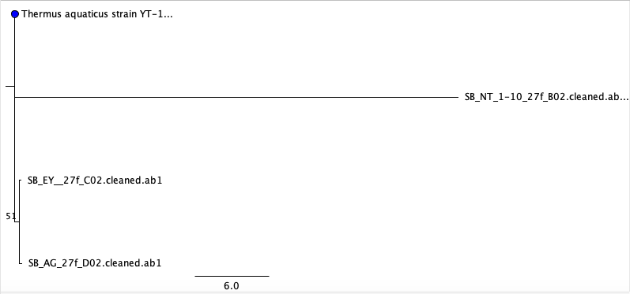
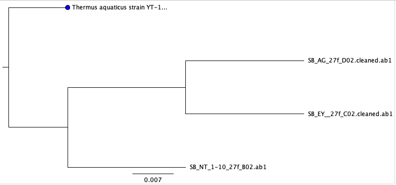

```{r setup, include = FALSE}
knitr::opts_chunk$set(echo = FALSE, message = FALSE, warning = FALSE)
```

# Introduction

The cellphone has become a staple in today's society. It's role has drastically 
expanded from its typical use, to call or to text someone. It's now used
as a GPS device, to browse the internet, and much more. Due to all of these 
applications, cellphones are being used almost all day, everyday by their 
owners. This daily use and the benefits provided by a cellphone, causes 
individuals to overlook cellphone hygeine, or even consider the amount of
bacteria that accumulates on the screen of a phone. 

Studies have been done in clinical settings, showing how healthcare 
professionals use their cellphones throughout the day, both before and after 
assessing patients. This resulted in a significant transfer of bacteria, since 
most cellphone users, healthcare workers included, do not clean their cellphone 
screens. Especially in a medical setting, this can cause more diseases and more infection,"...indicated that medical equipment and mobile phones of healthcare 
workers are a potential source of nosocomial infections" 
[@kumar2014identification]. This puts not only cellphone users at risk, but the 
patients, the health care workers and their families as well. 

However, healthcare workers are not the only ones with phones carrying bacteria, 
studies have shown that with a general cellphone user, there is 10x more 
bacteria on a cellphone screen than a toilet seat. Aside from clinical settings, 
I aimed to focus on a school setting, and to see whether cellphones used by 
students and professors also carried pathogenic bacteria. A study on the 
bacterial contamination of middle school students' cellphones concluded that 
teenagers have "...a median of 17,032 bacterial 16S rRNA gene copies per phone" 
[@cogprints6566]. Additionally,out of the number of bacteria found on these 
phones, a significant number of were labeled "potentially pathogenic". These 
bacteria included *E. faecalis* and many more. Furthermore, another study proved
that there is an extremely high amount of pathogens on cellphones of secondary 
school students "...94.5% of phones demonstrated evidence of bacterial 
contamination with different types of bacteria...*S. aureus* strains [were] 
isolated from mobile phones of 52% and those strains isolated from hands of 
37.7% were methicillin resistant"[@ulger2009we]. 

Another study conducted by the Department of Microbiology at Lagos State 
University focused on the actual spread of bacterial infections through the use 
of cellphones. Through this study they found a "...high percentage (62.0%) of 
bacterial infection..."[@akinyemi2009potential] resulted from the bacteria found
on cellphones. This shows the significance of the bacterial presence on 
cellphones. I wanted to find out the relevance of this issue in a school 
setting, and whether or not pathogens would still be found on cellphones outside 
of clinical settings. 

My project focuses on identifying the type and amount bacteria on the cell phone
screens of students at the University of San Francisco compared to those found 
on the cellphone screens of professors. This is to see whether or not phones 
carry potential pathogens, which are disease-causing bacteria, outside of a 
clinical setting. Thus, this experiment can help build a correlation between how
illnesses are spread on college campuses and technology usage.I will 
specifically focus on the presence of *Escherichia Coli*, *Staphylococcus*, and 
*Pseudomonas* as they are a few of the most common pathogens found on 
cellphones. 

These bacteria are known to cause serious infections. *Staphylococcus* for 
example, is a dangerous pathogen. This bacteria is known to cause endovascular
disorders, bone and joint disorders, respiratory issues, as well as skin 
disorders. The mortality rate,according to the New England Journal of Medicine, 
"...ranges from 11 to 43 percent..." [@lowy1998staphylococcus]. *E.coli* is 
a bacteria that normally is found in the human intestine as well as other 
animals. is transmitted through contamination of food, such a raw meats, or 
through the contact with fecal matter.

My questions for this project were: Do cellphones really carry potential 
pathogens? Do students have a higher amount of bacteria on their cellphones 
compared to professors? My hypothesis is that all cellphones will carry 
potential pathogens. Student cellphones will have a significantly higher amount 
of potential pathogens compared to professor cellphones. 

At the end of the project, I concluded that student cellphone screens had a 
larger number of colonies, as predicted. Therefore, my hypothesis was proven 
correct. However, the number of morphotypes found was higher on professors' 
cellphone screens. 

## Methods

### Sampling
Materials needed for this project include sterile PBS, 12 1.5mL tubes, and 
sterile swabs. For this project, I collected a total of twelve samples, two 
samples per cellphone. Therefore, I swabbed a total of six phones. To collect my 
samples, I used a sterile swab dipped in the buffer solution. I swabbed the 
entire front screen of each phone for 30 seconds and then stored the swab in a 
sterile tube. Once I finished collecting all my samples, I broke off the portion 
of the swab with my sample on it into separate tubes and labeled them 
accordingly.

### Culturing & DNA Extraction 
After extraction, samples were diluted to 1x, 10x, and 
100x using PBS solution, and then cultured. Then, I pipetted 100 μL of each 
sample onto a 100 mm TSA plate and used rattler beads to spread the sample 
evenly across the TSA plate. Once I plated my samples, they were incubated for 4
days and then analyzed for the number of morphotypes present and the amount of 
colonies. 

For DNA extraction, I followed the manufacturer's protocol from the Sigma 
REDExtract-N-Amp Kit [@kumar2014identification] From my TSA plate, I scraped 
samples from the most secluded colonies, trying to avoid colonies that were in 
contact with one another to try to avoid contamination. After this, I pipetted  
198 μL of the Qubit solution and 2 μL of my DNA extraction into a Qubit tube. 
After placing the Qubit solution and my sample in the Qubit tube, I vortexed 
this mixture for 5 seconds and incubated the tubes in the dark for 5 minutes.
Once this was complete, I used the Qubit to analyze the amount of DNA 
successfully extracted. 

### PCR and Gel Electrophoresis
The gel for the PCR was a standard 1% agarose gel and was prepared ahead of 
time by Professor Zimmerman. To prepare the gel, 1g of agarose is measured and 
mixed with 100mL of 1xTAE buffer in a microwaveable flask. This flask is then 
microwaved for 1-3 minutes until the agarose powder is completely dissolved. 
Then the agarose and buffer mixture is allowed to cool to the point where it is 
comfortable to hold the flask. It is then poured into the gel tray with the well
comb already set in place. Once poured, the tray with the agarose gel is set out
to cool for around 10 minutes or until fully hardened.  

To make the master mix for the PCR reaction, I used the formula: (n+1)+10%, 
where n is the number of samples I have, which in this case is six. With all 
the calculations, the master mix included 77 μL of Amp, 6.2 μL of the 27f 
primer, 6.2 μL of 1492r primer, 7.7 μL of BSA, and 49.28mL of PCR water. For 
each alloquat, I added 19 μL of the master mix and 1 μL of the specific DNA 
template.

These tubes were then taken into the thermocycler by Professor Zimmerman and 
set to run at the following temperatures:

| Temperature (°C) | Duration   |
|------------------|------------|
| 95°C             | 5 minutes  |
| 94°C             | 30 seconds |
| 65°C             | 30 seconds |
| 72°C             | 1 minute   |
| 94°C             | 30 seconds |
| 55°C             | 30 seconds |
| 72°C             | 1 minute   |
| 72°C             | 10 minutes |
| 4°C              | hold       |
**Table 1:** Table shows the thermocycler's various cycles, including the 
temperature of each cycle and its duration

Once the thermocycling was complete, the gel was carefully loaded with 2-20 μL pipettes and then run on the electrode for 30 minutes. 
"After checking for successful amplification using gel electrophoresis, PCR 
products were cleaned with Invitrogen ExoSAP and sent for unidirectional Sanger sequencing at MCLAB (South San Francisco, CA)." 

### Sanger Sequencing 


# Results

```{r load-libraries}
library("ggplot2")
library("dplyr")
library("tidyr")
library("readr")
library("broom")
library("knitr")
```

Table 2 shows the strains found through using BLAST, were *Kocuria palustris* 
with a 99.20% accuracy, *Staphylococcus* with a 99.80% accuracy, and 
*Staphylococcus epidermis* with an accuracy of 98.88%. 

Table 3 shows the qubit data, which is the amount of DNA present in each sample. 
The cellphone sample of student AG had a qubit value of 4.72. JI had a qubit 
value of 8.37, and the sample from student SB, which had a dilution of 1-10, had 
a qubit value of 6.21. The samples from professor SS, which had a dilution of 
1-10, had a qubit value of 7.02. Professor NT, which had a dilution of 1-10, had 
a qubit value of 5.49, and Professor EY had a qubit value of 11.30. 

Figure 1 shows boxplot which displays the number of colonies for the sample 
group, professors and students. The median value of the number of colonies for 
professors was 6, with a third quartile value of 23 colonies, and a maximum 
value of 41 colonies. The median value of the number of colonies for students 
was 37, with a minimum value of 2 colonies. The value of the first quartile is 
20 colonies, and the third quartile has a value of 44 colonies. The maximum 
value for students was 50 colonies. 

Table 4 shows the p-value as 1 for the number of colonies found on professors' 
and students' cellphone screens. Figure 2 shows a boxplot which displays the 
number of morphotypes for the sample group, professors and students. The median 
value of the number of morphotypes for professors was 1, with a third quartile 
value of 3 morphotypes, and a maximum value of 5 morphotypes. The median value 
of the number of morphotypes for students was 1, the third quartile value was 
2.5 morphotypes. The maximum value of morphotypes for students was 4. Table 5 
shows the resulting p-value as 1 from a statistical test perfomed for the
number of morphotypes found between professor and student cellphones screens.


| description                                                                       | max score | total score | query cover | E value   | per. identity | Accession  |
|-----------------------------------------------------------------------------------|-----------|-------------|-------------|-----------|---------------|------------|
| Kocuria palustris strain SR5-19 16S ribosomal RNA gene, partial sequence          | 1129      | 1129        | 100%        | 0.0       | 99.20%        | MN421514.1 |
| Staphylococcus sp. strain 21 16S ribosomal RNA gene, partial sequence             | 931       | 931         | 100%        | 0.0       | 99.80%        | MK465362.1 |
| Staphylococcus epidermidis strain IBK-11 16S ribosomal RNA gene, partial sequence | 473       | 473         | 100%        | 1x10^-129 | 98.88%        | MN428237.1 |
**Table 2:** Table shows the strains retrieved through the BLAST tool 


```{r read-in-culture-data}
# read in the culture data from csv
culture_data <- read_csv(
  "data/raw_data/raw_culture_count_data/BIOL422_culturing_data-Sheet1.csv")
```

| Sample       | Qubit Value |
|--------------|-------------|
| AG           | 4.72        |
| JI           | 8.37        |
| SB 1-10      | 6.21        |
| Prof SS 1-10 | 7.02        |
| Prof NT 1-10 | 5.49        |
| Prof EY      | 11.30       |
**Table 3:** Table shows the qubit value for the culture samples from both the students' cellphones and professors' cellphones 

```{r filter-and-plot-abundances}
# filter out only 100x dilutions and make boxplot
culture_data %>%
  filter(student_name == "Shreya Barma") %>%
  filter(dilution_1_10_or_100 == "1") %>%
  ggplot(aes(x = sample_group,
             y = number_of_colonies)) +
  geom_boxplot() +
  ggtitle("Comparison of Colony Abundances Between Student
          & Professor Cellphones", "1x dilution") +
  xlab("Sample Group") +
  ylab("Number of Colonies")
```

**Figure 1:** Boxplot of colony abundances from Professor and Student 
cellphones, 1x dilution. Despite a higher median number of colonies from student samples, the mean values were not significantly different between the two sites (Wilcox p = 1). 

```{r abundances-stats}
#run a statistical test to compare the two groups of abundances
culture_data %>%
  filter(student_name == "Shreya Barma") %>%
  filter(dilution_1_10_or_100 == "1") %>%
  wilcox.test(data = .,
              number_of_colonies ~ sample_group) %>%
  broom::glance(x = . ) %>%
  knitr::kable()
```
**Table 4:** Shows The p-value resulting from a statistical test for the number
of colonies found on cellphone screens between professors and students

```{r filter-and-plot-morphotypes}
# filter out only 100x dilutions and make boxplot
culture_data %>%
  filter(student_name == "Shreya Barma") %>%
  filter(dilution_1_10_or_100 == "1") %>%
  ggplot(aes(x = sample_group,
             y = as.numeric(number_of_morphotypes))) +
  geom_boxplot() +
  ggtitle(
    "Comparison of Morphotypes Between Student & Professor Cellphones", "1x dilution") +
  xlab("Sample Group") +
  ylab("Number of Morphotypes")
```

**Figure 2:**Boxplot showing the number of morphotypes from student cellphones compared to professor cellphones. Ther was no difference in the mean number of morphotypes (Wilcox p=1).

```{r morphotypes-stats}
#run a statistical test to compare the two groups of abundances
culture_data %>%
  filter(student_name == "Shreya Barma") %>%
  filter(dilution_1_10_or_100 == "1") %>%
  wilcox.test(data = .,
              as.numeric(number_of_morphotypes)~ sample_group) %>%
  broom::glance(x = .) %>%
  knitr::kable()
```
**Table 5:** Table shows p-value as a result from a statistical test for the 
number of morphotypes found between professor and student cellphones

  
**Figure 3:** Phylogeny shows This figure shows the phylogeny for Taq and its relationship to the bacteria found on the sample cellphones.   


**Figure 4:** This figure shows the phylogeny for Taq and its relationship to 
the bacteria found on the sample cellphones. 


**Figure 5:** Image shows the PCR results. Well 9 was sample "Prof SS 1-10", 
well 10 was sample "Prof NT 1-10", well 11 was sample "Prof EY", well 12 was 
sample "AG", well 13 was sample "SB 1-10", well 14 was sample "JI", and well 15 
contained a negative control, which was pure water. 

# Discussion

Table 2 shows the strains found through using BLAST, were *Kocuria palustris* 
with a 99.20% accuracy, *Staphylococcus* with a 99.80% accuracy, and 
*Staphylococcus epidermis* with an accuracy of 98.88%. 

Table 3 shows the qubit data, which is the amount of DNA present in each sample.
Specifically, samples "JI, Prof SS 1-10, and Prof EY" had relatively high qubit 
values, which means they had a relatively high amount of DNA in those samples.
JI had a qubit value of 8.37, The samples from professor SS, which had a 
dilution of 1-10, had a qubit value of 7.02. Professor EY had a qubit value of 
11.30. 

Figure 1 shows a boxplot which displays the number of colonies for the sample 
group, professors and students. The median value of the number of colonies for 
professors was 6, which means that, once placed in numerical order, the middle 
value of colonies was 6. Table 4 shows the p-value as 1 for the number of 
colonies found on professors' and students' cellphone screens. Therefore, with 
this p-value, I failed to reject the null hypothesis. Since, the null hypothesis
was not rejected, I can conclude that student cellphones carry more bacteria, 
and more potential pathogens, than those of professors. 

Figure 2 shows a boxplot which displays the number of morphotypes found on the 
cellphone screens of professors' compared to students'. The median value of the 
number of morphotypes for professors was 1. This means that, when placed in 
numerical order, 1 was the median value. The third quartile value of 3 
morphotypes, and a maximum value of 5 morphotypes. The median value of the 
number of morphotypes for students was 1 as well. Therefore we can conclude that,
disregarding outliers, 1 was the median number among both sample groups. 
Table 5 shows the resulting p-value as 1 from a statistical test perfomed for 
the number of morphotypes found between professor and student cellphones screens.
Given this value, I failed to reject the null hypothesis. Therefore, I can 
conclude that although students had a higher number of colonies on their 
cellphones, the number of morphotypes between both sample groups was similar. 

Figure 5 shows the image of the PCR results. Well 9 was sample "Prof SS 1-10", 
well 10 was sample "Prof NT 1-10", well 11 was sample "Prof EY", well 12 was 
sample "AG", well 13 was sample "SB 1-10", well 14 was sample "JI", and well 15 
contained a negative control, which was pure water. Wells 9, 13, 14, & 15 had no
band showing, which could have resulted from pipetting error or incorrect 
primers used. Well 10 had a brighter band, and wells 11 and 12 had fainter bands
as well. However, since wells 10-12 showed, I can conclude there was a 
significant amount of DNA present in the wells to perform the PCR and show up in
the image. 

 
# Sources Cited
```{r your-code-here}
# Add code chunks as needed for your analyses
```

