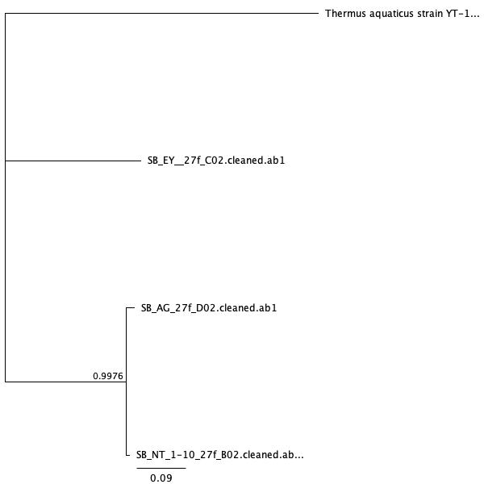

```{r setup, include = FALSE}
# global setup
knitr::opts_chunk$set(echo = FALSE, message = FALSE, warning = FALSE)
```

# Introduction

When the phone was first introduced to society, its sole purpose was to be able to communicate with others. Today, with the evolution to the cellphone, the role of the typical phone has drastically expanded from its intended use, to call or to text someone. It's now used as a GPS device, to browse the internet, play games, listen to music, and much more [@lonkila2008social]. Due to all of these new applications and the evolution of the traditional phone, cellphones are being used almost all day, everyday by their owners. This daily use and the benefits provided by a cellphone, causes individuals to overlook cellphone hygiene, or even consider the large amount of bacteria that accumulates on the screen of their phones. 

Studies have been done in clinical settings, showing how healthcare professionals use their cellphones throughout the day, both before and after assessing patients. This resulted in a significant transfer of bacteria, since most cellphone users, healthcare workers included, do not clean their cellphone screens [@arora2009cellphones]. It was found that out of 116 medical staff and students, almost 98% used their cellphone throughout the day and in the office, and 4% used them while attending to patients. From this group, around 53% Of 266 medical staff and students at the time of the study, 116 completed questionnaires (response rate = 44%). Almost all (98%) used mobile phones: 67% used their mobile phones for hospital-related matters; 47% reported using their phone while attending patients. Only 3% reported washing their hands after use and 53% reported never cleaning their phone [@ramesh2008use]. Especially in a medical setting, this can cause more diseases and more infection. Healthcare workers have been found to transmit nosocomial infections via their medical equipment and mobile phones [@kumar2014identification]. This puts not only cellphone users at risk, but the patients, the health care workers and their families as well. 

However, healthcare workers are not the only ones with phones carrying bacteria, studies have shown that with a general cellphone user, there is 10x more bacteria on a cellphone screen than a toilet seat [@akinyemi2009potential]. Aside from clinical settings, I aimed to focus on a school setting to see whether cellphones used by students and professors also carried pathogenic bacteria. Middle school students'cellphones have been found to have a median of 17,032 bacterial 16S rRNA gene copies per phone. Additionally,out of the number of bacteria found on these phones, a significant number were found to be potentially pathogenic. These bacteria included *E. faecalis* and many more [@cogprints6566].There is an extremely large amount of pathogens on cellphones of secondary school students, with over 94.5% of cellphones demonstrating evidence of bacterial contamination [@ulger2009we]. 

Another study conducted by the Department of Microbiology at Lagos State University focused on the actual spread of bacterial infections through the use of cellphones. Through this study they found a high percentage (62.0%) of bacterial infection being spread solely through cellphones and the lack of cleaning this technology [@akinyemi2009potential]. This shows the significance of the bacterial presence on cellphones. I wanted to find out the relevance of this issue in a school setting, and whether or not pathogens would still be found on cellphones outside  of clinical settings. 

Furthermore, studies show that simply by cleaning your cellphones, you can drastically decrease the amount of bacteria growing on your phones. A study conducted by a German university found that cellphone screens that had been cleaned or wiped a with a microfiber cloth or alcohol-impregnated lens wipes had significantly less bacterial colonies found than cellphone screens that remained uncleaned [@egert2015bacteria]. The same study was able to identify bacteria found on these cellphones to normally colonize on human skin, lungs, and mouth. They also were able to detect bacteria found in human fecal matter. 

One of the main goals of this project was to find one of the potential reasons college students get sick and how these illnesses could spread quickly across campuses. A majority of college students are known to have unhealthy habits, whether its an unhealthy diet, or not exercising. With intense amounts of stress piled on top, this leads to a weakened immune system, and, therefore, leaves a large number of college students easily susceptible and prone to illnesses [@hudd2000stress]. Since almost all students have a cellphone on them everyday, I thought that this project would be extremely relevant and helpful.

The purpose of my project was to show the importance of hygeine with an individual's technology, especially cellphones since we carry them around everywhere on a daily basis. My project focuses on identifying the type of bacteria and amount bacterial colonies on the cell phone screens of students at the University of San Francisco compared to those found on the cellphone screens of professors at the same university. This is to see whether or not phones carry potential pathogens, which are disease-causing bacteria, outside of a clinical setting [@schmidtchen2002proteinases]. 

College students are notorious for having bad hygeine and lifestyle habits [@dodd2010lifestyle]. From eating unhealthy food and not exercising, to not cleaning up their living spaces, I expect to find a significantly large amount of different bacterial colonies on their cellphone screens. In fact, a study conducted in Japan found that students with a more unhealthy lifestyle tend to spend an increased time on their cellphones [@ezoe2009relationships]. Also, these cellphones were tested for pathogenic bacteria, and they identified that students who had spent an increased amount of time on their cellphones, clearly had more potentially pathogenic bacteria found on their screens. 

Thus, this experiment can help build a correlation between how illnesses are spread on college campuses and technology usage. I will specifically focus on the presence of *Escherichia coli*, *Staphylococcus*, and *Pseudomonas* as they are a few of the most common pathogens found on cellphones [@lee2013contamination]. 

These bacteria are known to cause serious infections. *Staphylococcus* for example, is a dangerous pathogen. This bacteria is known to cause endovascular disorders, bone and joint disorders, respiratory issues, as well as skin disorders. The mortality rate ranges from 11 to 43 percent [@lowy1998staphylococcus]. *E.coli* is a bacteria that normally is found in the human intestine as well as other animals. is transmitted through contamination of food, such a raw meats, or through the contact with fecal matter.

My questions for this project were: Do cellphones really carry potential pathogens? Do students have a higher amount of bacteria on their cellphones compared to professors? My hypothesis is that all cellphones will carry potential pathogens and student cellphones will have a significantly higher amount of potential pathogens compared to professor cellphones. 

To test this hypothesis, I gathered a total of 6 samples using a sterile swab dipped in phosphate buffer solution. 3 of these samples were from different students and the remaining 3 samples were collected different professors. Once my samples were collected, I diluted each sample with PBS to 1x, 10x, and 100x and then cultured these samples on an agar dish. The two sets of samples, both the culture samples and the culture-free samples were  After incubation, I conducted two rounds of PCR to amplify the DNA samples for both my culture and culture-free samples, and gel electrophoresis to separate the DNA fragments. I, also, used Qubit to quantify DNA concentrations. Sanger sequencing was, then, used to sequence the cultured DNA samples. With these successful results, I used BLAST to run my samples against the NCBI database and figure out what strains my were. Illumina sequencing was conducted with the culture-free DNA samples and also identified using the DADA2 pipeline. Once all my results were sequenced, I edited them through Geneious Prime, used an alignment tool, MAFFT [@katoh2013mafft], and built phylogenies using Mr.Bayes and PhyML [@kearse2012geneious].

With this project, I concluded that student cellphone screens and professor cellphones had a similar amount of colonies. Also, the number of morphotypes on cellphone screens was found to be similar for both professor cellphone and student cellphones. Through this experiment, *E.coli* and *Pseudomonas* were not detected on any of the cellphone screens for neither students or professors. However, two different types of *Staphylococcus* were detected from my cultured samples via BLAST. Other bacteria which were not expected to be found, *Kocuria palustris*, *Mycoplasma wenyonii*, and *Streptococcus* were also detected from my culture-free samples via the DADA2 pipeline. I concluded that although the number of morphotypes and colony abundance was relatively similar for both sample groups, there was a significant amount of pathogens detected throughout both sample groups. 

# Methods

## Sampling

Materials needed to collect my samples include a sterile phosphate buffer solution (PBS), 12 1.5mL tubes, sterile swabs, and latex gloves. For this project, I collected a total of twelve samples, two samples per cellphone. I collected samples from 3 student cellphones and 3 professor cellphones, giving me a total of 6 cellphone screen samples. The samples were collected from students and faculty at the University of San Francisco, located in San Francisco, CA. To collect my samples, I used a sterile swab dipped in the buffer solution. I, then, swabbed the entire front screen of each phone for 30 seconds and then stored the swab in a sterile tube. Once I finished collecting all my samples, I broke off the portion of the swab with my sample on it into separate tubes and labeled them accordingly.

## Culture Samples

### Culturing & DNA Extraction 

After sampling, each sample was diluted to 1x, 10x, and 100x using PBS solution, and then cultured. I used 18 100 mm TSA plates for plating samples from each of my 2 treatments (n = 3 per group, 6 total). Then, I pipetted 100 μL of each sample onto a 100 mm TSA plate and used rattler beads to spread the sample evenly across the TSA plate [@leung1995survival]. Once I plated my samples, they were incubated for 4 days at 37°C and then analyzed for the number of morphotypes present and the amount of colonies. 

For DNA extraction, I followed the manufacturer's protocol from the Sigma REDExtract-N-Amp Kit [@kreader2001one]. From my TSA plate, using a toothpick, I scraped samples from the most secluded colonies, trying to avoid colonies that were in contact with one another to try to avoid contamination. After this, I pipetted 198 μL of the Qubit solution and 2 μL of my DNA extraction into a Qubit tube. After placing the Qubit solution and my sample in the Qubit tube, I vortexed this mixture for 5 seconds and incubated the tubes in the dark for 5 minutes. Once this was complete, I used the Qubit to analyze the amount of DNA successfully extracted. 

### PCR amplification and Gel Electrophoresis

The samples were diluted with PBS to 1x, 10x, and 100x. The formula to make the master mix for the PCR reaction was: (n+1)+10%, where n is the number of samples I have, which in this case is six. The master mix for the cultured samples included 10 μL of Amp, 0.8 μL of the 27f primer, 0.8 μL of 1492r primer, 1 μL of BSA, and 6.4 mL of PCR water. For each alloquat, I added 19 μL of the master mix and 1 μL of the specific DNA template [@korbie2008touchdown]. These tubes were then taken into the thermocycler and set to run at the following temperatures: 95°C for 5 minutes, 94°C for 30 seconds, 65°C for 30 seconds, 72°C for 1 minute, 94°C for 30 seconds, 55°C for 30 seconds, 72°C for 1 minute, 72°C for 10 minutes, and then finally placed on a 4°C hold. The touchdown PCR contained TAE buffer, SYBR safe dye, and a 2% agarose gel. Once the thermocycling was complete, the gel was carefully loaded with a pipette and then run on the electrode for 30 minutes at 140 volts. 

To prepare the gel, 1g of agarose is measured and mixed with 100mL of 1xTAE buffer in a microwaveable flask. This flask is then microwaved for 1-3 minutes until the agarose powder is completely dissolved. Then the agarose and buffer mixture is allowed to cooled slightly and then it is then poured into the gel tray with the well comb already set in place. Once poured, the tray with the agarose gel is set out to cool for around 10 minutes or until fully hardened [@voytas2000agarose]. 

### Sanger Sequencing 

This set of samples from the PCR was then sent for Sanger sequencing. After checking for successful amplification using gel electrophoresis, PCR products were cleaned with ExoSAP (Invitrogen) and sent for unidirectional Sanger sequencing at MCLAB located in South San Francisco, CA [@kreader2001one]. 

## Culture-Free Samples

### Culturing & DNA Extraction 

To make the master mix, the formula for the PCR reaction was: (n+1)+10%, where n is the number of samples I have, which in this case is six. The master mix for the culture-free samples included 10 μL of Amp, 0.8 μL 10 μM iseq 16sF primer, 0.8 μL 10 μM iseq 16sR primer, 1 μL BSA, and 6.4 mL of PCR water. For each alloquat, I added 19 μL of the master mix and 1 μL of the specific DNA template. These tubes were then taken into the thermocycler and set to run at the following temperatures: 95°C for 3 minutes, 95°C for 30 seconds, 55°C for 30 seconds, 72°C for 30 seconds, 72°C for 5 minutes, and then placed on a 4°C hold. The touchdown PCR included 2% agarose gel, TAE buffer, and SYBR safe dye. This set of samples were then sent for Illumina sequencing. The gel was prepared the same way it was for the cultured samples. Once the thermocycling was complete, the gel was carefully loaded and run for 30 minutes at 140 volts. 

### Illumina Sequencing

Following electrophoresis, PCR products were purified using AmpureXP magnetic beads [@meyer2010illumina] and quantitated using a PicoGreen fluorescent assay (Invitrogen) on a Tecan Infinite M Plex plate reader. Purified PCR products were used as the template for a second round of PCR, which served to attach unique pairs of forward and reverse Illumina barcodes (Nextera XT Index 2 kit). All other components of the PCR mixtures were as for the first-round PCR. These reactions were cycled at 95 degrees C for 3 minutes, then 8 cycles of: 95°C for 30 s, 55°C for 30s, and 72°C for 30s, followed by a 5 minute elongation cycle at 72°C. Following this amplification, PCR products were purified and normalized with a SequelPrep normalization plate (Invitrogen), pooled, and then quantified once again with a Qubit 4 fluorometer (Invitrogen) and a TapeStation 4200 (Agilent) to verify library size and concentration. This library was then diluted to the loading concentration (50 pM) and combined with an Illumina PhiX spike-in library (5% spike in) and sequenced on an Illumina iSeq using a 2 x 150 bp consumable cartridge.

### Sequence Analysis

After receiving all of my data from Sanger sequencing, I used Geneious Prime to analyze and trim my samples as well as build phylogenies based off of my sequences. I trimmed the ends of my sequences, any low quality sequences, and used the IUPAC ambiguity codes to rename bases. Once the sequences from all of my samples were trimmed, I used the NCBI website's BLAST tool to determine what strains of bacteria were found on the cellphone screens I swabbed and infer the function of my sample sequences from similar sequences found in the archive [@madden2013blast]. Using BLAST, I chose the results that were not unspecified, and had a high percentage match. Of the 3 samples that failed, I marked these files as failed sequences and did not use them for this project. I used MAFFT to create a multiple alignment sequence [@katoh2013mafft]. Additionally, I created a Bayesian and Maximum Likelihood Phylogeny using Geneious as well. The setup for Mr.Bayes included having the substitution model as GTR, rate variation as invgamma,and outgroup set as *Thermus aquaticus*. The MCMC settings for chain length was set to 1,100,000, heated chains was set to 4, heated chain temp was set to 0.2, subsampling freq set to 200, the burn-in length set to 100,000, and the random seed length was set to 10,736. The rest of the settings were on default [@kearse2012geneious]. The setup for PhyML included having the substitution model as GTR, the branch support set as bootstrap and the number of bootstraps being 100. The rest of the settings were on default [@masters2011species]. Only 3 of my samples ran successfully and gave results. 

For the culture-free data, I assessed the quality of each of my FastQC files and then used trimmomatic to remove the unusable or failed sequences. Bioawk converted the fastq files to fasta files. I ran a script on terminal that ran my sample sequences against GenBank and gave me the BLAST results for each of my samples. 

I used the DADA pipeline on my data to count the number of chimeras and the total Amplicon Sequence Variants. The DADA pipeline was also used to remove extra sequences and determine the taxonomy of each of my samples [@callahan2016dada2]. To begin, I assessed the quality profiles for both the forward and reverse reads for each of my samples and the controls from the Illumina sequencing. Then, I trimmed and filtered through the .gz files as well as noted the error rates for each step. Then, both the forward and reverse reads were combined to provide the completed denoised sequence. Using the denoised sequence I retrieved, I was able to make the Amplicon Sequence Variant table and the OTU table. Following this, I removed the chimeric sequences and assigned taxonomy sequence variants. Lastly, I exported the trimmed, denoised, cleaned, and filtered sequence variants to create and build a phylogeny. Finally, using phyloseq, I created a phyloseq table to further understand and analyze the microbiome of my samples [@mcmurdie2013phyloseq]. 

# Results

There were two main methods used throughout this project:culture samples and Sanger sequencing as well as culture-free samples and Illumina sequencing. The main goal of this study was to not only identify the bacteria found on cellphone screens but also quantify colony abundance and morphotypes. I also wanted to figure out if any of the bacteria found in any of my samples were pathogenic. I was able to identify *Kocuria palustris*, *Staphylococcus*, and *Staphylococcus epidermis* via Sanger sequencing. I also identified *Mycoplasma wenyonii*, *Streptococcus salivarius*, *Staphylococcus aureus*, and *Streptococcus pneumoniae* via Illumina sequencing. The only bacteria identified that was consistent in both methods was *Staphylococcus*, the rest of the results were inconsistent. 

```{r load-libraries}
# loading libraries
library("ggplot2")
library("dplyr")
library("tidyr")
library("readr")
library("broom")
library("knitr")
library("dada2")
library("phyloseq")
library("mctoolsr")
library("seqinr")
library("citr")
library("lubridate")
library("forcats")
```

## Culture Sample and Sanger Sequencing Results
To gather my culture sample results, I cultured colonies from the samples I collected, extracted and quantified the DNA using Qubit, conducted PCR and gel electrophoresis. Once this was done and Sanger sequencing was done, I trimmed and cleaned the sequences. Then, I used MAFFT to align these sequences and later created a Maximum Likelihood phylogeny and a Bayesian phylogeny. Finally, I ran the successful samples through the NCBI's BLAST tool to identify exactly what bacteria I had gathered. 

Using BLAST to identify my Sanger sequences, I found *Kocuria palustris* with a 99.20% accuracy,  *Staphylococcus* with a 99.80% accuracy, and *Staphylococcus epidermis* with an accuracy of 98.88% (Table 1). After loading the files onto Geneious, I found that only 3 out of my 6 samples were usable (Table 2). The Qubit data is the amount of DNA present in each sample, or the DNA concentration. Specifically, samples "JI, Prof SS 1-10, and Prof EY" of the cultured samples had relatively high DNA concentrations (Table 3). The Qubit data from my culture-free samples also had relatively high DNA concentrations, with samples “JI, Prof NT, and Prof EY” having the highest Qubit values (Table 4). 

The median value of the number of colonies for professors was 6, compared to the median value of the number of colonies for students which was 37. Students also had a maximum value of colonies of 50 colonies compared to the maximum value of colonies for professors, which was near 25 (Figure 1). However, given the p-value of 1, there was no significant difference in the number of colonies between the two sample groups (Table 5, Wilcox p-value = 1). The median value of the number of morphotypes for professors was 1 with and a maximum value of 5 morphotypes. The median value of the number of morphotypes for students was 1, with the maximum value of 4. Both of these groups show a similar value for the number of morphotypes (Figure 2). There was no significant difference between the number of morphotypes for both sample groups (Table 6, Wilcox p-value = 1). Given both of these p-values, I failed to reject the null hypothesis. Therefore, I can conclude that although students seemed to have a higher number of colonies on their cellphones, the number of morphotypes between both sample groups was similar. 

The Maximum Likelihood phylogeny shows no support that the bacteria from my samples are from the same clade as *Thermus aquaticus*. There is support, however, that two of my bacterial samples are within the same clade, *Staphylococcus* and *Staphylococcus epidermis* (Figure 3, Bootstrap = 100). The Mr.Bayes phylogeny shows that there is no support that the bacteria from my samples are from the same clade as *Thermus aquaticus*. There is significant support showing that both *Staphylococcus* and *Staphylococcus epidermis* are from the same clade, which is understandable since they are both the same genus (Figure 4, posterior probability = 0.9976).

In the gel electrophoresis image for the cultured DNA samples, well 9-11 were samples collected from professors; "SS 1-10", "NT 1-10", and "EY" respectively. Wells 12-14 were samples collected from students; "AG", "SB 1-10", and "JI", respectively. Well 15 contained a negative control, which was pure water and the ladder was also included. The only bands that showed up were from samples “Prof NT, Prof EY, and AG”. Furthermore, even though these bands did show, they were still faint (Figure 5). The rest of the samples showed no bands present in the image. 

## Culture-Free Samples and Illumina Sequencing Results
To gather my results for my culture-free samples, I analyzed the sequence qualities by running FastQC reports. I, then, cleaned and trimmed my sequences using Trimmomatic. Once again, my samples were run through the BLAST tool to identify the bacterial strain and later determine the amount of varying taxa within each of my samples. I was also able to determine the most commonly occurring taxa and genera, as well as the number of sequences present. 

In the gel electrophoresis image for the culture-free DNA samples, no bands showed at all. In fact, all of my samples remained in their wells (Figure 6). The ladder was also included as a reference. 

After loading my sequences into trimmomatic, I ended up with sequences that were trimmed, cleaned, and filtered. I found that my input reads for each of my samples were all above 10,000 sequences, and that after trimmomatic had run all of my sequences had a surviving percentage above 94%. The sample with the lowest input reads and the lowest surviving percentage was sample “SB” with an input read of 11685 and a surviving percentage of 94.21% (Table 7). 

I also ran FastQC reports on my culture-free samples and determined the sequence quality. None of my samples were flagged as poor quality. Sample "AG" had a total of 15604 sequences and the %GC was 51%. Sample "JI" had a total of 13319 sequences and the %GC was 52%. Sample "SB" had a total of 11685 sequences and the %GC was 50%. Sample "Prof EY" had a total of 17265 sequences and the %GC was 52%. Sample "Prof NT" had a total of 13229 sequences and the %GC was 52%. Finally, sample "Prof SS" had a total of 13521 sequences and the %GC was, also, 52%. These reports show that my sequences were good quality and, therefore, strengthens and supports my findings. 

For my culture-free samples using Illumina sequencing, the BLAST results identified *Mycoplasma wenyonii*, *Streptococcus salivarius*, *Staphylococcus aureus*, and *Streptococcus pneumoniae* (Table 8). Among these results, *Streptococcus salivarius* had the highest number of matched sequences at 30840 sequences, and *Staphylococcus aureus* had the highest amount of different taxa present with 279 different colonies (Table 8).

The most abundant sequences amongst all my samples from both sample groups, were identified to be from the Phyla: Actinobacteria, Firmicutes, and Proteobacteria. There was also a large amount of sequences that were not able to be traced to their Phyla, and were ultimately unidentifiable (Figure 7). All my samples from both professors and students, plus the positive control had a top abundance of the Phylum Firmicutes. The negative control, which was just distilled PCR water, was found to have bacterial sequences in it. The top Phylum for the negative control was Proteobacteria (Table 9).

The most abundant classes found amongst both samples groups were identified to be: Actinobacteria, Bacilli, Gammaproteobacteria (Figure 8). There was also a large amount of sequences which could not be identified, and were thus labeled “N/A”. The highest sum abundance was Bacilli at 3000. There was no evidence of the following classes: Acidobacteria groups 1,4, and 7, Armatimonadia, Deinococci, Epsilonproteobacteria, Erysipeiotrichia, Gemmatimonadetes, Ktedonobacteria, and Verrucomicrobiae (Figure 8). 

The negative control sequences had a few that were unidentifiable, but also had sequences from the Phyla Proteobacteria, Firmicutes, and Actinobacteria. The positive control had sequences from the Phyla Proteobacteria and Firmicutes. Professor samples had sequences, some of which could not be identified, but also had sequences which were found to come from the Phyla Proteobacteria, Firmicutes, Chloroflexl, Bacteroidetes, and Actinobacteria (Figure 9). Student samples also had the same identification as professors, however they varied slightly in the abundance. In professor samples, there was a higher sum abundance of Firmicutes compared to the student samples (Figure 9). 

To look at specific pathogens, I found that each cellphone sample from both sample groups had some amount of *Streptococcus* present. Sample “JI” had the largest presence of *Streptococcus* and sample “SB” had the lowest number of strains found (Figure 10). I, also, found that each cellphone sample from both sample groups had presence of *Staphylococcus* present (Figure 11). Sample “EY” had the largest amount of this bacteria present on the cellphone screen and sample “JI” had the lowest amount of *Staphylococcus* present (Figure 11). It is interesting to see that sample “JI” had the highest amount of *Streptococcus* present, yet the lowest number of *Staphylococcus* bacteria present. 

I ran my data set through the DADA pipeline. This removed extra sequences, counted the number of chimeras, and the total Amplicon Sequence Variants. The pipelines was also used to determine the taxonomy of each sample. The DADA pipeline identified 84 bimeras out of 775 input sequences. I had 91.61 nonchimeric reads, therefore, I had 8.39 chimeric reads. 

# Discussion

The objective of this study was to figure out what strains of pathogenic bacteria were to be found on cellphones and to also see which sample group had a higher amount of bacteria on their phones. I hypothesized that all cellphones would carry potential pathogens, since a majority of people have their phones on them every place they go. I, also, hypothesized that student cellphones would have a significantly higher amount of potential pathogens compared to professor cellphones. 

The bacteria found using BLAST for my cultured samples were: *Kocuria palustris*, *Staphylococcus aerus*, and *Staphylococcus epidermis* (Table 1). Going back to my main hypothesis, I did not find any presence of *E.coli* or *Pseudomonas* on any of my samples. I did, however, find significant presence of *Staphylococcus* (Table 1). *Kocuria palustris* is a bacteria that is found in the milk of water deer and reindeer [@kovacs1999kocuria]. There is not much research found on this specific species of *Kocuria*, however this bacteria has been found to be morphologically similar to *Staphylococci* and *Micrococci* [@mattern2014keratitis]. This was a puzzling bacteria to find on the screen of a cellphone, as those animals are not within the vicinity of the school campus. However, since these samples were collected from professors within the biology department; I believe that this bacteria might have been transferred onto a cellphone during one of the hikes or excursions some classes take into wilderness. Two types of *Staphylococcus* were also identified to be on the screens of the phones that were swabbed and sampled. The *Staphylococcus aerus* bacteria is frequently found in the upper respiratory tract and on the skin [@lowy1998staphylococcus]. It is also a known virulent pathogen that is currently the most common cause of infection in hospitalized patients. Furthermore, this bacteria produces several toxins within the body. One type of toxin being cytotoxins that induce proinflammatory changes in mammalian cells which can lead to extensive cell damage and eventual sepsis syndrome [@archer1998staphylococcus]. The *Staphylococcus epidermis* bacteria is, however, found to not cause disease; but, rather maintain a benign relationship with the host. This bacteria is currently being studied for its role in balancing the epithelial tissue and providing a number of resistance genes [@otto2009staphylococcus]. It is understandable that *Staphylococcus epidermis* was found on the cellphone screens of both professors and students, since this bacteria is found on the outer layers of the skin. Since a majority of people put their phones up to their ear, potentially pressing the phone against their faces, to place phone calls; as well as using the touchscreen with their hands to navigate through different applications, the *Staphylococcus* bacteria would have ample opportunity to be transferred onto cellphone screens. 
Since these two bacterial strains are found most commonly on the skin or within the areas on campus, I am confident that these results were correctly identified. Both the Maximum Likelihood phylogeny and the Bayesian phylogeny show results that supports these findings (Figure 1 & 2). 

Out of my 6 original samples, only 3 came out as usable sequences (Table 2). This probably resulted from having a mixed sample. It was very difficult to identify isolated colonies, so it is highly likely that I collected samples from two different colonies. I am certain that this was the reason half of my sequences were not usable.

The qubit values for my culture samples were all relatively high except for sample “AG” which still had a decent amount of DNA quantified at 4.72 ng/μL. The highest DNA concentration was in sample “EY” (Table 3). The qubit values for my culture-free samples were also relatively high and all my samples were within the 7-8 ng/μL range (Table 4). 

My results showed that the number of morphotypes on both student and professor cellphones were similar (Figure 2). In contrast, the colony abundance was significantly greater on student cellphones compared to that of the professors' cellphones, with the median value for the student group being around 37 colonies and the median value for the professor sample group being around 6 colonies (Figure 1). 

The statistical test conducted for the number of colonies present on the cellphone screens of professors compared to students provided a p-value of 1 (Table 5). With this p-value in mind, I reject the null hypothesis that students have more pathogenic bacteria on their cellphone screens compared to those of professors. However, the box plot does show a difference in the colony abundances, and therefore suggests that, with a larger sample size, a significant difference between the two groups would be seen. This means that if this setup was done with a larger sample size, the student sample group would be found to have a higher colony abundance on their cellphone screens compared to professors.

The statistical test conducted for the number of morphotypes present on the cellphone screens of professors compared to students provided a p-value of 1 (Table 6). With this p-value in mind, I reject the null hypothesis that students have a higher amount of different pathogenic bacteria on their cellphone screens compared to those of professors. Therefore, I conclude that there was no significant difference between the number of morphotypes between both sample groups, students and professors. 

My deduction from these findings are that the number of morphotypes are similar because both students and teachers spend a majority of their time in the classroom and/or within similar regions on campus. Therefore, both groups would be exposed to the same bacteria and have an equal likelihood of having the same groups of bacterial strains found on the screens of their cellphones. This is also shown through the study done in a clinical setting which displayed that most nurses and doctors had a similar set of bacteria and viruses found on their phones [@ulger2009we]. Similar to how both professors and students had similar bacteria on their cellphone screens, students and professors were found to have a similar amount of colony abundance on their cellphones. However, with a larger sample size, students would be seen to have a higher colony abundance on their screens compared to professors.  This is, most likely, due to millennials using  their devices more frequently than their teachers. Since students use their cellphones more often, they transfer more bacteria to their devices.  

The Maximum Likelihood phylogeny provides no evidence that any of my samples belong in the same clade as *Thermus aquaticus*. There is support, however, that two of my samples are from the same clade. This is understandable as I found two strains of *Staphylococcus* in my cultured samples. Since these two strains, *Staphylococcus* and *Staphylococcus epidermis* are from the same genus, it makes sense that they were placed in the same clade (Figure 3, bootstrap = 100). The Bayesian phylogeny provides also provides no evidence that any of my samples belong in the same clade as *Thermus aquaticus*. However, there is support that the same two samples are within the same clade, since the two samples which tested to be *Staphylococcus* are part of the same genus (Figure 4, posterior probability = 0.9976). 

In the PCR image of the cultured samples, wells 9, 13, 14 had no band showing, which could have resulted from pipetting error, using incorrect primers, or just the sample DNA being bound really tightly. Well 10 had a brighter band, and wells 11 and 12 had fainter bands as well. Well 15 was the negative control, PCR water, so it was expected that no band would show. However, since wells 10-12 showed, I can conclude there was a significant amount of DNA present in the wells to perform the PCR and show up in the image (Figure 5). 

In the PCR image of the culture-free samples, no bands showed. In fact, based off the image, it looks like the samples still remained in the wells even after having a voltage passed through the gel (Figure 6). This is probably because the bacterial DNA within the samples were much too large to pass through the gel. This could have been solved by using a different type of gel. Another reason why this could have occurred was I used the wrong primers. 

For my culture-free samples, the BLAST results identified *Mycoplasma wenyonii*, *Streptococcus salivarius*, *Staphylococcus aureus*, and *Streptococcus pneumoniae* (Table 8). Going back to my main hypothesis, I did not find any presence of *E.coli* or *Pseudomonas* or *Staphylococcus* in any of my culture-free samples. *Mycoplasma wenyonii* is a bacteria that lacks a cell wall around its cell membrane. This is known to make them naturally resistant to antibiotics that target cell wall synthesis. This genus of bacteria can be parasitic and some can also be saprotrophic [@genova2011severe]. There is not much research showing this specific bacteria’s effect on humans, however a veterinary study shows that *Mycoplasma wenyonii* causes poor appetite, tachypnea, fever, tachycardia, lethargy, and clinical anemia in cattle [@gladden2015case]. This also could have ended up on a cellphone the same way *Kocuria palustris* was found, through using a cellphone while on a hike or excursion. *Streptococcus salivarius* is a species of gram-positive, anaerobic bacteria that colonizes in the oral cavity and upper respiratory tract of humans a few hours after birth. Therefore, this makes further exposure to this bacteria virtually harmless [@ruoff1989bacteremia]. This bacteria is shown to have helpful properties, so much so, that cough drops that contain this are marketed to support immunity against other *Streptococcus* strains. This also is a reasonable find on a cellphone. Most individuals hold up his or her phone to the face and near the mouth when making a phone call, so this bacteria can easily be transferred to the cellphone screen at any point. *Staphylococcus aureus* is one of the most dangerous within its genus. It is present in the nose, temporarily, in 30% of healthy adults. This bacteria can be spread through direct contact of its carriers, contaminated objects, or inhalation. This bacteria is known to cause skin infections, pneumonia, heart valve infections, bone infections, meningitis, and toxic shock syndrome [@chambers2001changing]. This could have been found on a cellphone screen if anyone was sick or if anyone who was a carrier happened to come into contact with the cellphone screen I sampled. This is a common pathogen, so it is understandable that this bacteria was identified. The last bacteria identified was *Streptococcus pneumoniae*. This bacteria is, also, a gram-positive bacteria and it is known to be responsible for the majority of community-acquired pneumonia [@appelbaum1992antimicrobial]. *Streptococcus pneumoniae* is normally found in the human respiratory tract, therefore it does benefit the human body, without causing harm. However, an infection with this species can cause pneumonia, bronchitis, otitis media, septicemia, and meningitis. This also is a bacteria found on someone who is significantly ill, and therefore, this is understandable to find on a cellphone. If one of the members of the sample group was sick, or just getting better, this bacteria could have easily been transferred to their cellphone screen and collected for sampling.   

By using trimmomatic to crop my Illumina sequences and remove adapters, I found that my culture-free data remained above 93% intact. This means that each one of my samples survived (Table 7).

The most common phyla found amongst my all culture-free samples included Actinobacteria, Firmicutes, and Proteobacteria (Figure 7). Actinobacteria does contain certain bacteria that are known to be pathogenic, which aligns with my findings. Firmicutes also include pathogens and it is also found to be correlated with obesity and Type II diabetes [@mariat2009firmicutes]. Proteobacteria is a major phylum of gram-negative bacteria and also includes a variety of pathogenic bacteria. For both professors and students, the top Phylum found was Firmicutes (Table 9). The negative control also had a top Phylum match with Proteobacteria, with an abundance of 11261. (Table 9). This indicated that there was contamination, since distilled PCR water should not contain any bacteria at all. This contamination could have occurred through misusing the pipette, or by not filling in the water into a clean tube. Professors had a top match with Firmicutes with an abundance of 17349, and students also had a top match with Firmicutes with an abundance of 14749 (Table 9). This shows that, unlike my original thought, professor cellphone screens actually had an increased amount of sum abundance of Firmicutes compared to the cellphone screens of students. There was also a significant amount of bacteria that could not be identified, with a sum abundance of around 1500. This could have resulted from some of the bacteria not being researched enough or not been part of GenBank. 

To go into a little more detail, the classes identified from my culture-free data included Acidobacteria groups 3 and 6, Actinobacteria, Alphaproteobacteria, Bacilli, Bacteroidia, Chloroplast, Clostridia, Cyanobacteria, Cytophagia, Deltaproteobacteria, Flavobacteriia, Fusobacteriia, Gammaproteobacteria, Negativicutes, Planctomycetia, and Sphingobacteria (Figure 8). The most prevalent classes, however, were Actinobacteria, Alphaproteobacteria, Bacilli, Bacteroidia, Chloroplast, and Gammeproteobacteria. There was also a significant amount of unidentifiable sequences (Figure 8). Actinobacteria is a class of gram-positive bacteria that is found normally in the soil. Alphaproteobacteria is also a class of bacteria that has a very diverse number of species, most of the species within this class lack cell walls and can be found within undersurface soil, or glacial ice. Bacilli is also a very diverse class of bacteria and colonizes a variety of different habitats. Some bacilli can also be found in human fecal matter. These bacteria could have been found on a cellphone screen if someone accidentally dropped their phone while on the grass or somewhere near any soil. Chloroplast was an interesting find, and this could have been transferred to the screen of a cellphone if someone happened to drop their phone in the grass, or was even eating a sandwich. Gammaproteobacteria is a class of bacteria that contains several pathogenic species. 

Both the negative and positive controls had a high abundance of bacteria. The negative control had the largest sum abundance of Proteobacteria and Actinobacteria. The positive control had the largest sum abundance of Firmicutes (Figure 9). With both of the professor and student samples, the largest sum abundance was also Firmicutes, but there was also a presence of Chloroflexl and Bacteroidetes (Figure 9). 

Looking back to my main intention of this project, I wanted to find out what pathogenic bacteria spreads around campus causing college students to get sick. As I mentioned earlier, *Streptococcus* was one of the main pathogenic bacteria identified, and there is a significant amount of this specific bacteria found on every single one of my samples (Figure 10). In fact, all but one phone had a n value of 10 or more for this pathogen. Another pathogenic bacteria that was identified through this project was *Staphylococcus*there was also a significant amount found on every single sample tested (Figure 11). Both of these bacteria are definitely pathogenic and are known to cause illnesses such as fevers, meningitis, pneumonia, pharyngitis, and much more. This goes to show just how dirty our cellphones can be and it is common for this bacteria to be around in our environment. When looking at my culture data, BLAST determined the bacteria to be *Kocuria palustris*, *Staphylococcus aerus*, and *Staphylococcus epidermis*. When looking at my culture-free data, however, I did not have the same results. I found *Mycoplasma wenyonii*, *Streptococcus salivarius*, *Staphylococcus aureus*, and *Streptococcus pneumoniae* via BLAST in my culture-free samples. The results from the DADA pipeline varied slightly with my BLAST results. The DADA pipeline results showed that the most common Phyla amongst both sample groups were Actinobacteria, Bacilli, Gammaproteobacteria. Of these, only Bacilli is a phylum that is potentially pathogenic to humans. 

A study which discussed the disinfecting protocols for hospital employees covered a relatively efficient way to clean a cellphone. In fact, cleaning hospital employees’ cellphones with 70% isopropyl alcohol reduced the amount of bacteria grown on the cellphone screen by 79% [@brady2012nhs]. This shows that cleaning the screen of a cellphone can significantly decrease the amount of bacteria present, both pathogenic and nonpathogenic. Since this method is not only efficient, but also inexpensive, it can be easily applied to the general public as well. Through my study, it is evident that pathogens have a large presence within the environment, and individuals, especially, carry them around on their cellphone screens on a daily basis. In hopes of reducing the amount of bacteria individuals may expose themselves to, research has shown that taking a few minutes to clean a cellphone screen is quite effective. To carry this research forward, this project could be replicated with larger sample groups to ensure that these findings are well-supported. Furthermore, the scope could also be broadened to other, commonly-used technology such as laptops or at-home, desktop computers. This would also further support the need to maintain proper hygienic habits for all personal technology. 

# Figures and Tables 

| description                                                                       | max score | total score | query cover | E value   | per. identity | Accession  |
|-----------------------------------------------------------------------------------|-----------|-------------|-------------|-----------|---------------|------------|
| *Kocuria palustris* strain SR5-19 16S ribosomal RNA gene, partial sequence          | 1129      | 1129        | 100%        | 0.0       | 99.20%        | MN421514.1 |
| *Staphylococcus* sp. strain 21 16S ribosomal RNA gene, partial sequence             | 931       | 931         | 100%        | 0.0       | 99.80%        | MK465362.1 |
| *Staphylococcus epidermidis* strain IBK-11 16S ribosomal RNA gene, partial sequence | 473       | 473         | 100%        | 1x10^-129 | 98.88%        | MN428237.1 |

**Table 1:** Table shows the cultured sample strains retrieved through the BLAST tool

| Sequence Locus | Original Filename      | Corrected Filename             | Usability | Length after Trimming | Number of Manual Corrections |
|----------------|------------------------|--------------------------------|-----------|-----------------------|------------------------------|
| 16s            | SB_AG_27f_D02.ab116s   | SB_AG_27f_D02.cleaned.ab1      | Usable    | 506                   | 4                            |
| 16s            | SB_EY__27f_C02.ab1     | SB_EY__27f_C02.cleaned.ab1     | Usable    | 627                   | 2                            |
| 16s            | SB_JI_27f_F02.ab1      | SB_JI_27f_F02.failed.ab1       | Unusable  | 5                     | 1                            |
| 16s            | SB_NT_1-10_27f_B02.ab1 | SB_NT_1-10_27f_B02.cleaned.ab1 | Usable    | 264                   | 7                            |
| 16s            | SB_SB_1-10_27f_E02.ab1 | SB_SB_1-10_27f_E02.failed.ab1  | Unusable  | 5                     | 1                            |
| 16s            | SB_SS_1-10_27f_A02.ab1 | SB_SS_1-10_27f_A02.failed.ab1  | Unusable  | 5                     | 1                            |
| 16s            | SB_Neg_27f_G02.ab1     | SB_Neg_27f_G02.failed.ab1      | Unusable  | 5                     | 0                            |

**Table 2:** Sequence Analysis cleaned and trimmed using Geneious

```{r read-in-culture-data}
# read in the culture data from csv
culture_data <- read_csv(
  "data/raw_data/raw_culture_count_data/BIOL422_culturing_data.csv")
```

| Sample       | Qubit Values (ng/μL)|
|--------------|-------------|
| AG           | 4.72        |
| JI           | 8.37        |
| SB 1-10      | 6.21        |
| Prof SS 1-10 | 7.02        |
| Prof NT 1-10 | 5.49        |
| Prof EY      | 11.30       |

**Table 3:** Table shows the qubit values for the culture samples from both the students' cellphones and professors' cellphones 

| Sample  | Qubit Values (ng/μL) |
|---------|----------------------|
| AG      | 7.74                 |
| JI      | 8.38                 |
| SB      | 7.82                 |
| Prof SS | 7.72                 |
| Prof NT | 8.18                 |
| Prof EY | 8.1                  |

**Table 4** Table shows the qubit values for the culture free samples from both the student cellphone samples and the professor cellphone samples

```{r filter-and-plot-abundances}
# filter out only 100x dilutions and make boxplot
culture_data %>%
  filter(student_name == "Shreya Barma") %>%
  filter(dilution_1_10_or_100 == "1") %>%
  ggplot(aes(x = sample_group,
             y = number_of_colonies)) +
  geom_boxplot() +
  ggtitle("Comparison of Colony Abundances Between Student
          & Professor Cellphones", "1x dilution") +
  xlab("Sample Group") +
  ylab("Number of Colonies")
```

**Figure 1:** Box plot of colony abundances from Professor and Student cellphones, 1x dilution. Despite a higher median number of colonies from student samples, the mean values were not significantly different between the two sites (Wilcox p = 1).

```{r abundances-stats}
# run a statistical test to compare the two groups of abundances
culture_data %>%
  filter(student_name == "Shreya Barma") %>%
  filter(dilution_1_10_or_100 == "1") %>%
  wilcox.test(data = .,
              number_of_colonies ~ sample_group) %>%
  broom::glance(x = .) %>%
  knitr::kable()
```

**Table 5:** Shows The p-value resulting from a statistical test for the number of colonies found on cellphone screens between professors and students

```{r filter-and-plot-morphotypes}
# filter out only 100x dilutions and make boxplot
culture_data %>%
  filter(student_name == "Shreya Barma") %>%
  filter(dilution_1_10_or_100 == "1") %>%
  ggplot(aes(x = sample_group,
             y = as.numeric(number_of_morphotypes))) +
  geom_boxplot() +
  ggtitle(
    "Comparison of Morphotypes Between Student & Professor Cellphones",
    "1x dilution") +
  xlab("Sample Group") +
  ylab("Number of Morphotypes")
```

**Figure 2:**Box plot showing the number of morphotypes from student cellphones compared to professor cellphones. There was no difference in the mean number of morphotypes (Wilcox p=1).

```{r morphotypes-stats}
#run a statistical test to compare the two groups of abundances
culture_data %>%
  filter(student_name == "Shreya Barma") %>%
  filter(dilution_1_10_or_100 == "1") %>%
  wilcox.test(data = .,
              as.numeric(number_of_morphotypes)~ sample_group) %>%
  broom::glance(x = .) %>%
  knitr::kable()
```

**Table 6:** Table shows p-value as a result from a statistical test for the 
number of morphotypes found between professor and student cellphones


**Figure 3:** This figure shows the Maximum Likelihood phylogeny for Taq and its relationship to the bacteria found on the sample cellphones.   



**Figure 4:** This figure shows the Mr.Bayes phylogeny for Taq and its relationship to the bacteria found on the sample cellphones. 

 

**Figure 5:** Image shows the PCR results of the cultured samples

 

**Figure 6:** Image shows the PCR results of the culture-free samples

| Sample                    | Input Reads | Surviving | Surviving Percentage | Dropped | Dropped Percentage |
|---------------------------|-------------|-----------|----------------------|---------|--------------------|
| SB-AG_S26_L001_R1_001     | 15604       | 14935     | 95.71%               | 669     | 4.29%              |
| SB-JI_S27_L001_R1_001     | 13319       | 12674     | 95.16%               | 645     | 4.84%              |
| SB-SB_S28_L001_R1_001     | 11685       | 11009     | 94.21%               | 676     | 5.79%              |
| SB-ProfEY_S25_L001_R1_001 | 17265       | 16433     | 95.18%               | 832     | 4.32%              |
| SB-ProfNT_S29_L001_R1_001 | 13229       | 12599     | 95.24%               | 630     | 4.76%              |
| SB-ProfSS_S30_L001_R1_001 | 13521       | 12894     | 95.36%               | 627     | 4.64%              |

**Table 7:** Table shows the trimmomatic results of all sample sequences

| Sample ID                 | Bacteria                 | Number of Matched Sequences | Amount of Different Taxa |
|---------------------------|--------------------------|-----------------------------|--------------------------|
| SB-AG_S26_L001_R1_001     | *Mycoplasma wenyonii*     | 2789                        | 241                      |
| SB-JI_S27_L001_R1_001     | *Streptococcus salivarius* | 30840                       | 180                      |
| SB-SB_S28_L001_R1_001     | *Mycoplasma wenyonii*      | 2833                        | 179                      |
| SB-ProfEY_S25_L001_R1_001 | *Staphylococcus aureus*    | 6231                        | 279                      |
| SB-ProfNT_S29_L001_R1_001 | *Streptococcus pneumoniae* | 2966                        | 259                      |
| SB-ProfSS_S30_L001_R1_001 | *Streptococcus pneumoniae* | 3611                        | 240                      |

**Table 8:** Table shows the culture-free BLAST results

```{r phyloseq-data}
# load in the saved phyloseq object to work with
load("output/phyloseq_obj.Rda")

# melt phyloseq obj into a data frame for dplyr/ggplot
# analysis and visualization
melted_phyloseq <- psmelt(phyloseq_obj)

# turn all factor columns into character columns for dplyr
melted_phyloseq <- melted_phyloseq %>%
  mutate_if(is.factor, as.character)
```

```{r sequence-counts}
# create a summary table of sequence counts for each Phylum
melted_phyloseq %>%
  filter(student_initials == "SB") %>%
  group_by(Phylum) %>%
  summarize(sum_abundance = sum(Abundance,
                                  na.rm = TRUE)) %>%
  ggplot(aes(x = Phylum,
             y = sum_abundance)) +
  geom_col(position = position_dodge()) +
  theme(axis.text.x = element_text(angle = 90,
                                    hjust = 1,
                                    vjust = 1)) +
   ylab("Sum Abundance") +
  ggtitle("Sequence Counts for Each Phylum")
```

**Figure 7:**Bar graph shows the summarized sequence counts for my samples for each phylum

```{r phylum-abundance}
# Create a table showing the abundance of each Phylum per sample group
melted_phyloseq %>%
  group_by(type, Phylum) %>%
  summarize(abundance = sum(Abundance,
                            na.rm = TRUE)) %>%
  top_n(1) %>%
  kable()
```

**Table 9:** Table shows the abundance of the top Phylum for each sample group including controls

```{r sequence-counts-chart}
# create a summary table of sequence counts for each Phylum
melted_phyloseq %>%
  filter(student_initials == "SB") %>%
  group_by(Class) %>%
  summarize(sum_abundance = sum(Abundance,
                                  na.rm = TRUE)) %>%
  ggplot(aes(x = Class,
             y = sum_abundance)) +
  geom_col(position = position_dodge()) +
  theme(axis.text.x = element_text(angle = 90,
                                    hjust = 1,
                                    vjust = 1)) +
   ylab("Sum Abundance") +
  ggtitle("Sequence Counts for Each Class")
```

**Figure 8:** Bar graph shows the summarized sequence counts for my samples for each class


```{r taxa-abundance}
# bar plot of taxa my month sampled
melted_phyloseq %>%
  group_by(type, Sample, Phylum) %>%
  summarize(sum_abund = sum(Abundance,
                            na.rm = TRUE)) %>%
  filter(sum_abund > 0) %>%
  ggplot(aes(x = type,
             y = sum_abund,
             fill = Phylum,
             color = Phylum)) +
  theme(axis.text.x = element_text(angle = 90,
                                    hjust = 1,
                                    vjust = 1)) +
  geom_col(position = position_fill()) +
  xlab("Sample") +
   ylab("Sum Abundance") +
  ggtitle("Abundance of Phylum")
```

**Figure 9:** Bar plot shows the abundance of each taxa per sample group and both controls

```{r strain-diversity-of-streptococcus}
# look at number of strains within Strep spp. across samples
melted_phyloseq %>%
  filter(student_initials == "SB") %>%
  filter(Genus == "Streptococcus") %>%
  filter(Abundance > 0) %>%
  group_by(type, Sample) %>%
  tally() %>%
  ggplot(aes(x = Sample,
             y = n)) +
  geom_col() +
  facet_wrap(~type, scales = "free_x") +
  ylab("Strain Diversity") +
  ggtitle("Strain Diversity of Streptococcus per Sample")
```

**Figure 10:** Bar graph shows the number of different strains of *Streptococcus* found on each cellphone screen and is divided by sample group

```{r strain-diversity-of-Staphylococcus}
# look at number of strains within Staph across samples
melted_phyloseq %>%
  filter(student_initials == "SB") %>%
  filter(Genus == "Staphylococcus") %>%
  filter(Abundance > 0) %>%
  group_by(type, Sample) %>%
  tally() %>%
  ggplot(aes(x = Sample,
             y = n)) +
  geom_col() +
  facet_wrap(~type, scales = "free_x") +
   ylab("Strain Diversity") +
  ggtitle("Strain Diversity of Staphylococcus per Sample")
```

**Figure 11:** Bar graph shows the number of different strains of *Staphylococcus* found on each cellphone screen and is divided by sample group

# Sources Cited
